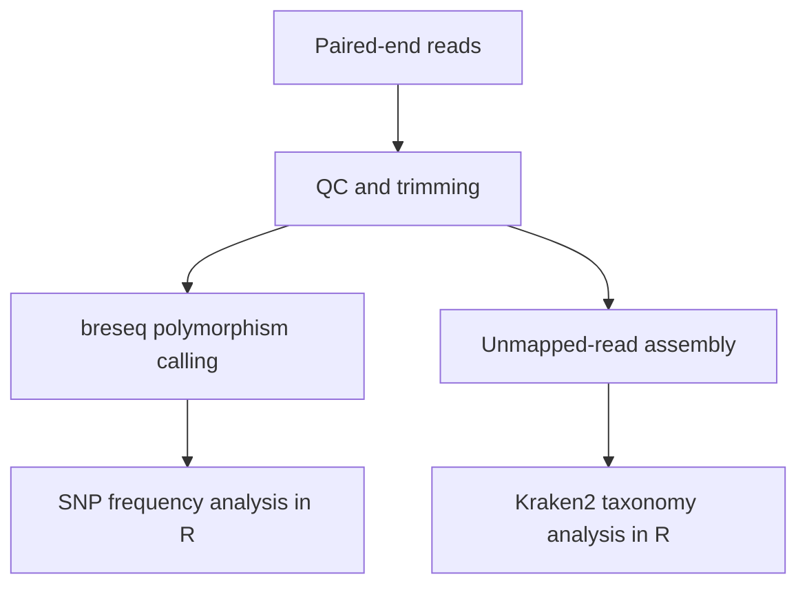
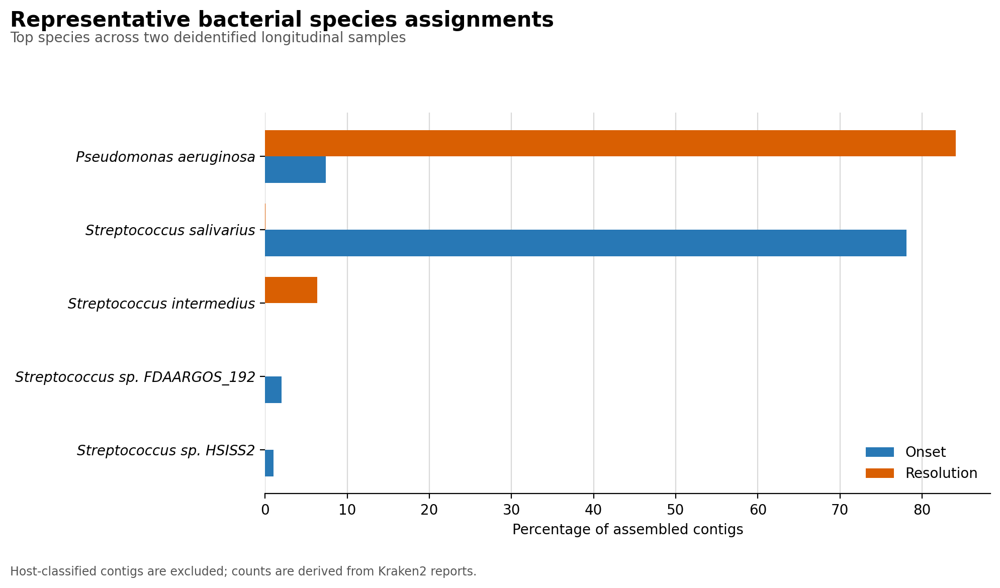

# Within-host variation in a cystic fibrosis _Pseudomonas aeruginosa_ lineage

This repository contains two reusable R workflows developed from an MSc
bioinformatics project on short-read sequencing of the Prairie Epidemic Strain
(PES) of _Pseudomonas aeruginosa_ in cystic fibrosis.

The code focuses on:

1. annotating breseq-derived SNPs and comparing allele frequencies between
   longitudinal samples; and
2. joining de novo assembled, unmapped contigs to Kraken2 classifications to
   investigate their likely taxonomic origin.

The original work was run on a SLURM high-performance computing cluster.
Patient-derived reads and complete project outputs are not redistributed here.
Small synthetic inputs are included so both R workflows can be tested without
access to the study data.

## Analysis overview



The original analysis examined nine longitudinal isolates from four patients.
Eight well-covered samples exceeded 95% reference alignment and retained an
average of 247 SNPs after applying `QUAL >= 10`. PA1874 contained a recurring
set of low-frequency variants. Most assembled unmapped sequence was classified
as _P. aeruginosa_, although strain-level and horizontal-transfer
interpretations require additional validation.

These observations describe the original study dataset; the included synthetic
data are intended only to demonstrate the code.

## Representative real results

The repository also contains a compact, deidentified example derived from two
real longitudinal project samples:



Only aggregate taxonomy counts, cumulative lengths, a compact Kraken2 report
summary, and selected reference annotations are included. Original sample IDs,
contig identifiers, per-contig k-mer hit lists, reads, and assembled sequences
are excluded. Host-classified assignments are collapsed to
`Host-classified`.

**These representative outputs remain patient-associated research results.
Confirm public sharing with the supervisor or data owner before pushing the
`results/representative_real/` directory to GitHub.** See the
[representative-results documentation](results/representative_real/README.md)
for provenance and regeneration instructions.

## Repository layout

```text
.
├── R/
│   ├── common.R
│   ├── snp_frequency_analysis.R
│   └── unmapped_contig_taxonomy.R
├── config/
│   ├── example_samples.tsv
│   └── product_aliases.tsv
├── data/
│   ├── README.md
│   └── example/
├── docs/
│   └── upstream_hpc_workflow.md
├── scripts/
│   ├── install_r_dependencies.R
│   ├── prepare_representative_results.py
│   └── run_examples.sh
├── tests/
│   ├── validate_example_outputs.R
│   └── validate_representative_results.py
├── results/
│   └── representative_real/
├── .github/workflows/
│   └── smoke-test.yml
├── environment.yml
└── LICENSE
```

## Quick start

### Option 1: Conda

```bash
conda env create -f environment.yml
conda activate cf-pes-genomics
bash scripts/run_examples.sh
```

### Option 2: an existing R installation

Use R 4.4 or later, then install the required packages and run the examples:

```bash
Rscript scripts/install_r_dependencies.R
bash scripts/run_examples.sh
```

Example outputs are written to `results/example/`.

## Workflow 1: SNP frequency analysis

```bash
Rscript R/snp_frequency_analysis.R \
  --snp-dir data/example/snp_tables \
  --gff data/example/P749_subset.gff3 \
  --metadata config/example_samples.tsv \
  --aliases config/product_aliases.tsv \
  --out-dir results/snp \
  --qual-threshold 10 \
  --fixed-threshold 0.95 \
  --top-n 5
```

Each input file must be named `<sample>_snps_breseq.tsv` and contain eight
tab-delimited columns in this order:

| Column  | Meaning                                         |
| ------- | ----------------------------------------------- |
| `CHROM` | Reference sequence name                         |
| `POS`   | One-based variant position                      |
| `REF`   | Reference allele                                |
| `ALT`   | Alternate allele                                |
| `QUAL`  | Variant quality score                           |
| `AF`    | Alternate allele frequency from 0 to 1          |
| `AD`    | Allele depth value retained from the source VCF |
| `DP`    | Total read depth                                |

A header row is optional. The script:

- retains all SNPs, including intergenic SNPs;
- annotates overlaps against CDS or gene features in the supplied GFF3;
- prefers a CDS when the same SNP overlaps both a CDS and its parent gene;
- filters using a user-defined quality threshold;
- labels fixed and marginal SNPs using a configurable frequency threshold;
- creates all pairwise longitudinal comparisons within each patient; and
- writes analysis tables, a top-feature plot, pairwise frequency plots, and
  `sessionInfo.txt`.

## Workflow 2: unmapped contig taxonomy

```bash
Rscript R/unmapped_contig_taxonomy.R \
  --megahit-dir data/example/megahit \
  --kraken-dir data/example/kraken2 \
  --metadata config/example_samples.tsv \
  --out-dir results/contigs \
  --top-n 7
```

For every sample in the metadata file, the workflow expects:

```text
<megahit-dir>/<sample>/final.contigs.fa
<kraken-dir>/<sample>.out
<kraken-dir>/<sample>.report
```

It supports standard five-column Kraken2 classification output, including
output created with `--use-names`, plus standard six-column and
minimizer-enriched eight-column reports. FASTA lengths are treated as
authoritative. Contigs without a resolved classification remain in the output
as `Unclassified`.

## Sample metadata

The metadata file is tab-delimited and contains:

| Column      | Meaning                                                |
| ----------- | ------------------------------------------------------ |
| `sample`    | Exact identifier used in filenames and MEGAHIT folders |
| `label`     | Plotting label                                         |
| `patient`   | Patient or longitudinal group                          |
| `timepoint` | Timepoint label used on pairwise plots                 |
| `order`     | Integer plotting order                                 |

Replace `config/example_samples.tsv` with a version describing your own
samples. Sample IDs are validated before analysis so a typo fails early rather
than silently dropping data.

## Reproducibility notes

- No script uses `setwd()` or a machine-specific path.
- All inputs, thresholds, and output locations are command-line arguments.
- Package and tool versions are recorded in `environment.yml`.
- Each R workflow writes `sessionInfo.txt`.
- Synthetic data are exercised by a GitHub Actions smoke test.
- Kraken2 results depend on the exact database contents. Record the database
  type, build date, source libraries, and checksum alongside real results.
- The upstream command-line interface is documented in
  [`docs/upstream_hpc_workflow.md`](docs/upstream_hpc_workflow.md).

## Scope and limitations

This is research code for demonstrating a bioinformatics workflow. It is not a
clinical diagnostic pipeline. Taxonomic assignment does not by itself establish
horizontal gene transfer, and variants from poorly covered samples should be
interpreted cautiously.

## Software documentation

- [breseq](https://barricklab.org/breseq)
- [Kraken2 manual](https://github.com/DerrickWood/kraken2/wiki/Manual)
- [MEGAHIT](https://github.com/voutcn/megahit)
- [Bakta](https://bakta.readthedocs.io/)

## License

The code and synthetic examples are released under the MIT License. The
original patient-derived sequencing data are not covered by this repository.
